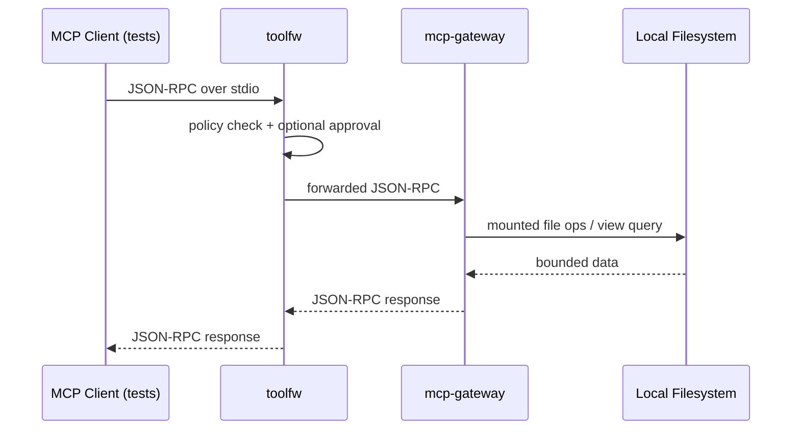

# trust-stack

trust-stack is a Rust monorepo MVP showing a gated MCP-like composition path: client test harness -> `toolfw` stdio proxy -> `mcp-gateway` stdio server -> local filesystem mounts and views.



## Quickstart

1. Build:

```bash
cargo build --workspace
```

2. Run gateway:

```bash
target/debug/mcp-gateway --mounts configs/examples/gateway.mounts.yaml --views configs/examples/gateway.views.yaml
```

3. Run proxy in front of gateway:

```bash
target/debug/toolfw proxy stdio --policy configs/examples/toolfw.policy.yaml --approval-store ./approval-store.json -- target/debug/mcp-gateway --mounts configs/examples/gateway.mounts.yaml --views configs/examples/gateway.views.yaml
```

4. Approve a request:

```bash
target/debug/toolfw approve --approval-store ./approval-store.json <approval_request_id>
```

## Audit Verification

Generate an audit signing key (prints public key to stdout):

```bash
target/debug/toolfw audit keygen --out ./audit-signing-key.json
```

Run proxy with signed checkpoints:

```bash
target/debug/toolfw proxy stdio --policy configs/examples/toolfw.policy.yaml --approval-store ./approval-store.json --audit ./audit.jsonl --audit-checkpoint ./audit.checkpoint.json --audit-signing-key ./audit-signing-key.json -- target/debug/mcp-gateway --mounts configs/examples/gateway.mounts.yaml --views configs/examples/gateway.views.yaml
```

Verify audit integrity:

```bash
target/debug/toolfw audit verify --audit ./audit.jsonl --checkpoint ./audit.checkpoint.json --pubkey ./audit-signing-key.json
```

## C2PA Inspect

Inspect an asset directly with the CLI:

```bash
target/debug/c2pa-inspect ./path/to/asset.jpg --json --trust=off
```

Inspect via MCP through the gateway tool:

```json
{"jsonrpc":"2.0","id":10,"method":"tools/call","params":{"name":"c2pa.inspect","arguments":{"mount":"notes","path":"asset.jpg","trust":"off"}}}
```

Edit example config paths before real use.
