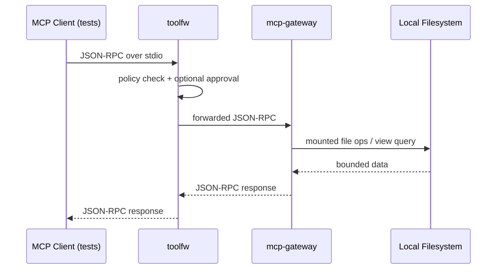

# trust-stack

trust-stack is a Rust monorepo MVP showing a gated MCP-like composition path: client test harness -> `toolfw` stdio proxy -> `mcp-gateway` stdio server -> local filesystem mounts and views.



## Quickstart

1. Build:

```bash
cargo build --workspace
```

2. Run gateway:

```bash
target/debug/mcp-gateway --mounts configs/examples/gateway.mounts.yaml --views configs/examples/gateway.views.yaml
```

3. Run proxy in front of gateway:

```bash
target/debug/toolfw proxy stdio --policy configs/examples/toolfw.policy.yaml --approval-store ./approval-store.json -- target/debug/mcp-gateway --mounts configs/examples/gateway.mounts.yaml --views configs/examples/gateway.views.yaml
```

4. Approve a request:

```bash
target/debug/toolfw approve --approval-store ./approval-store.json <approval_request_id>
```

## Audit Verification

Generate an audit signing key (prints public key to stdout):

```bash
target/debug/toolfw audit keygen --out ./audit-signing-key.json
```

Run proxy with signed checkpoints:

```bash
target/debug/toolfw proxy stdio --policy configs/examples/toolfw.policy.yaml --approval-store ./approval-store.json --audit ./audit.jsonl --audit-checkpoint ./audit.checkpoint.json --audit-signing-key ./audit-signing-key.json -- target/debug/mcp-gateway --mounts configs/examples/gateway.mounts.yaml --views configs/examples/gateway.views.yaml
```

Verify audit integrity:

```bash
target/debug/toolfw audit verify --audit ./audit.jsonl --checkpoint ./audit.checkpoint.json --pubkey ./audit-signing-key.json
```

## Client Identity & Capability Tokens

Capability tokens reuse the same `SigningKeyFile` format as audit signing keys.

Issue a token:

```bash
target/debug/toolfw auth issue --signing-key ./audit-signing-key.json --client alice --tools views.query --views notes_recent --ttl-seconds 3600
```

Verify a token:

```bash
target/debug/toolfw auth verify --pubkey ./audit-signing-key.json --token <token>
```

Enforce capability tokens at the gateway:

```bash
target/debug/mcp-gateway --mounts configs/examples/gateway.mounts.yaml --views configs/examples/gateway.views.yaml --auth-pubkey ./audit-signing-key.json
```

Request shape with token:

```json
{"jsonrpc":"2.0","id":10,"method":"tools/call","params":{"name":"views.query","arguments":{"view":"notes_recent"},"auth":{"token":"v1.<payload_b64url>.<sig_b64url>"}}}
```

## Keyring, Rotation, Revocation

Initialize a keyring:

```bash
target/debug/toolfw auth keyring init --out ./auth-keys.json
```

Generate a signing key and add it to the keyring:

```bash
target/debug/toolfw audit keygen --out ./alice-signing-key.json
target/debug/toolfw auth keyring add --keys ./auth-keys.json --pubkey ./alice-signing-key.json --note "alice key v1"
```

Issue and verify tokens with the keyring:

```bash
target/debug/toolfw auth issue --signing-key ./alice-signing-key.json --client alice --tools views.query --views notes_recent --ttl-seconds 3600
target/debug/toolfw auth verify --keys ./auth-keys.json --token <token>
```

Start gateway/proxy with multi-key verification:

```bash
target/debug/mcp-gateway --mounts configs/examples/gateway.mounts.yaml --views configs/examples/gateway.views.yaml --auth-keys ./auth-keys.json
target/debug/toolfw proxy stdio --policy configs/examples/toolfw.policy.yaml --approval-store ./approval-store.json --auth-keys ./auth-keys.json -- target/debug/mcp-gateway --mounts configs/examples/gateway.mounts.yaml --views configs/examples/gateway.views.yaml --auth-keys ./auth-keys.json
```

Rotate and revoke:

```bash
target/debug/toolfw auth rotate --keys ./auth-keys.json --out-signing-key ./alice-signing-key-v2.json --note "alice key v2"
target/debug/toolfw auth keyring revoke --keys ./auth-keys.json --key-id <old_key_id> --note "compromised"
```

## C2PA Inspect

Inspect an asset directly with the CLI:

```bash
target/debug/c2pa-inspect ./path/to/asset.jpg --json --trust=off
```

Inspect via MCP through the gateway tool:

```json
{"jsonrpc":"2.0","id":10,"method":"tools/call","params":{"name":"c2pa.inspect","arguments":{"mount":"notes","path":"asset.jpg","trust":"off"}}}
```

Edit example config paths before real use.

## Developer Workflow

Local quality gates:

```bash
cargo fmt --all --check
cargo clippy --workspace --all-targets -- -D warnings
cargo test --workspace
```

Preflight proxy configuration before runtime:

```bash
target/debug/toolfw doctor proxy-stdio --policy configs/examples/toolfw.policy.yaml --approval-store ./approval-store.json --audit ./audit.jsonl --audit-checkpoint ./audit.checkpoint.json --audit-signing-key ./audit-signing-key.json --auth-keys ./auth-keys.json --gateway-mounts configs/examples/gateway.mounts.yaml --gateway-views configs/examples/gateway.views.yaml
```

CI enforces `fmt`, `clippy`, `test`, and `cargo deny check`.
